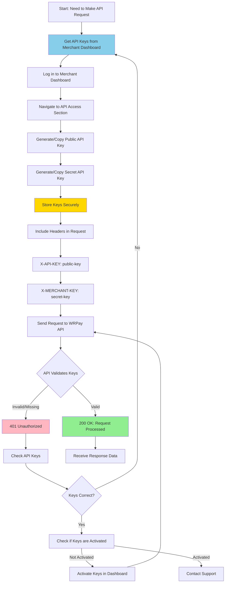

# Authentication

All API requests require authentication using API keys. This guide explains how to authenticate your requests to the WRPay API.

## Authentication Flow



## API Keys

To authenticate API requests, you need two API keys:

- **X-API-KEY** - Your merchant public API key
- **X-MERCHANT-KEY** - Your merchant secret API key

Both keys are required for every API request.

## Obtaining API Keys

1. Log in to your merchant dashboard
2. Navigate to **API Access** section
3. Generate or view your API credentials
4. Copy both the **Public API Key** and **Secret API Key**

⚠️ **Important**: Keep your secret API key secure and never expose it in client-side code or public repositories.

## Authentication Method

The WRPay API uses **API Key authentication** via HTTP headers. Include both headers in every request:

```
X-API-KEY: your-public-api-key
X-MERCHANT-KEY: your-secret-api-key
```

## Example Request

Here's an example of an authenticated request using cURL:

```bash
curl -X GET "https://sandbox.ilonapay.com/api/v2/wallets" \
  -H "X-API-KEY: your-public-api-key" \
  -H "X-MERCHANT-KEY: your-secret-api-key"
```

## Example Request (JavaScript)

```javascript
const response = await fetch('https://sandbox.ilonapay.com/api/v2/wallets', {
  method: 'GET',
  headers: {
    'X-API-KEY': 'your-public-api-key',
    'X-MERCHANT-KEY': 'your-secret-api-key',
    'Content-Type': 'application/json'
  }
});

const data = await response.json();
```

## Example Request (Python)

```python
import requests

headers = {
    'X-API-KEY': 'your-public-api-key',
    'X-MERCHANT-KEY': 'your-secret-api-key',
    'Content-Type': 'application/json'
}

response = requests.get(
    'https://sandbox.ilonapay.com/api/v2/wallets',
    headers=headers
)

data = response.json()
```

## Authentication Errors

If authentication fails, you will receive a `401 Unauthorized` response:

```json
{
  "message": "Unauthorized"
}
```

Common causes of authentication errors:

- Missing `X-API-KEY` header
- Missing `X-MERCHANT-KEY` header
- Invalid API key
- Expired API key
- API key not activated

## Security Best Practices

1. **Never commit API keys to version control** - Use environment variables or secure configuration management
2. **Use different keys for sandbox and production** - Keep environments separate
3. **Rotate keys regularly** - Generate new keys periodically for security
4. **Restrict key permissions** - Use the minimum required permissions for your use case
5. **Monitor API usage** - Regularly check your API usage in the merchant dashboard
6. **Use HTTPS only** - Always make requests over HTTPS, never HTTP

## Environment Variables

Store your API keys securely using environment variables:

```bash
# .env file (never commit this)
WRPAY_API_KEY=your-public-api-key
WRPAY_MERCHANT_KEY=your-secret-api-key
WRPAY_BASE_URL=https://sandbox.ilonapay.com
```

Then reference them in your code:

```javascript
// JavaScript/Node.js
const apiKey = process.env.WRPAY_API_KEY;
const merchantKey = process.env.WRPAY_MERCHANT_KEY;
```

```python
# Python
import os

api_key = os.getenv('WRPAY_API_KEY')
merchant_key = os.getenv('WRPAY_MERCHANT_KEY')
```

## Testing Authentication

You can test your authentication by making a simple request to the wallets endpoint:

```bash
curl -X GET "https://sandbox.ilonapay.com/api/v2/wallets" \
  -H "X-API-KEY: your-public-api-key" \
  -H "X-MERCHANT-KEY: your-secret-api-key"
```

A successful response indicates your authentication is working correctly.

## Next Steps

- Review the [API Overview](./overview.md) to understand the API structure
- Explore the available endpoints in the sidebar navigation
- Start with the Payments endpoints to process your first transaction

